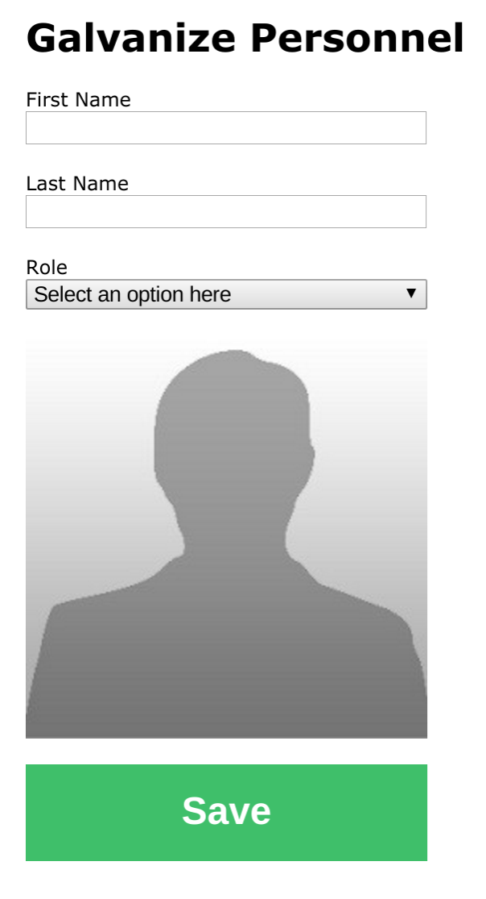

## Galvanize Telephone Personnel

You are making an app for your new company that assigns roles to employees. You'll need to:

* Read a list of roles from an external URL
* Read a list of employees from an external URL
* Read values from a text input, checkbox, radio button, and drop down
* Send form data to an external URL
* Respond to change events
* Respond to callbacks
* Deploy to a public URL

## Instructions

1. Using the included `index.html` file, create a form that includes:
    * A first name input (with a label)
    * A last name input (with a label)
    * A drop-down menu for roles (with a label and a placeholder that says "Select an option here")
    * An image with the placeholder graphic `assets/placeholder.jpg`
    * A submit button
    * An empty paragraph
    * When finished, your form should look like this: 
1. Using the included `app.js` file, add the following behavior
    * The list of roles in the dropdown menu should be pulled from [this API](https://secure-eyrie-78012.herokuapp.com/roles) and appended to your drop-down
    * Whenever the role is changed, the image should be updated with the `imageURL` of that role
    * Whenever the form is submitted the form values should be `POST`ed to `https://secure-eyrie-78012.herokuapp.com/users` in the following format:
        * `{firstName: "Kyle", lastName: "Coberly", role: 1}`
    * When the result of the `POST` from the save button returns, you should display the resulting `message` should be added to the empty paragraph, displayed for 4000ms, and then removed.
    * When finished, your form should be able to do this: 
1. If you do it right, the following combinations should return `Success!`
    * Kyle Coberly, Assassin
    * Danny Fritz, Commando
    * Roberto Ortega, Commando
    * Elana Kopelevich, Siren
    * All other combinations should return `Not quite.`
1. Deploy your work and add a link to it [here](#)
# telephone-3
